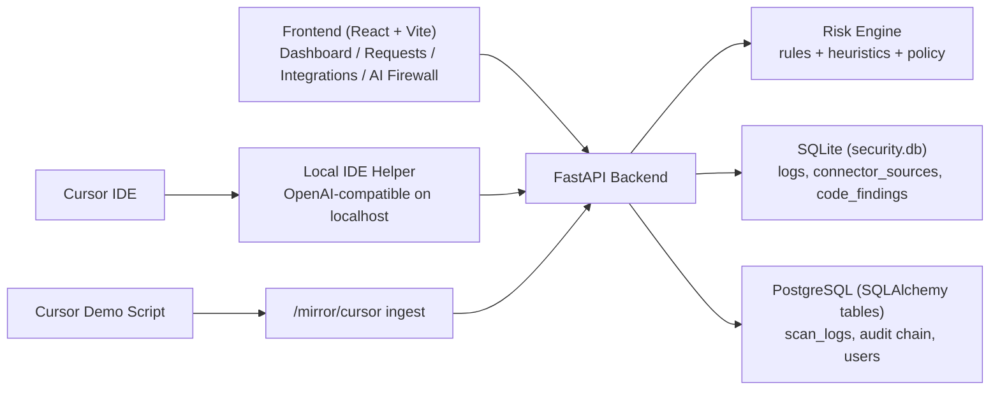

# AI Security Monitoring Tool: Spec, Architecture, and Cursor Connectivity

Last updated: 2026-04-05

## 1. Product Scope

The AI Security Monitoring Tool is a gateway-first security platform for AI prompt/response traffic.  
It provides:

- Real-time prompt risk detection and policy enforcement
- Allow/Warn/Redact/Block style decisions
- Persistent logging and analyst action workflows
- Dashboard-driven monitoring across requests, supply chain, posture, agentic risks, and AI firewall operations
- Connector-based ingestion for IDEs (including Cursor) and mirror sources

---

## 2. Current System Architecture

### Key runtime components

- Backend app bootstrap: `/Users/snarayanan/Documents/AI Security/ai_security_monitoring_tool/backend/app/main.py`
- Security routes: `/Users/snarayanan/Documents/AI Security/ai_security_monitoring_tool/backend/app/routes/security.py`
- Local persistence layer: `/Users/snarayanan/Documents/AI Security/ai_security_monitoring_tool/backend/app/sqlite_store.py`
- Frontend router/nav: `/Users/snarayanan/Documents/AI Security/ai_security_monitoring_tool/frontend/src/App.jsx`, `/Users/snarayanan/Documents/AI Security/ai_security_monitoring_tool/frontend/src/components/SidebarNav.jsx`

---

## 3. Current Frontend Functional Surface

Sidebar pages currently exposed:

1. Dashboard
2. Requests
3. Integrations
4. Vulnerability Findings (Supply Chain route)
5. Posture
6. AI Firewall
7. Agentic AI Risks
8. Reports

Primary page-route map is maintained in:

- `/Users/snarayanan/Documents/AI Security/ai_security_monitoring_tool/frontend/src/App.jsx`

---

## 4. Backend API Specification (Implemented)

### Auth

- `POST /auth/register`
- `POST /auth/login`
- `GET /auth/me`

### Security core

- `POST /scan`
- `POST /process-prompt`
- `GET /logs`
- `GET /analytics`
- `GET /threat-summary`
- `POST /scan-url`

### Gateway connectors / control plane

- `GET /gateway/sources`
- `POST /gateway/sources`
- `POST /gateway/sources/{source_id}/rotate-key`
- `POST /gateway/sources/{source_id}/disable`
- `POST /gateway/sources/{source_id}/enable`
- `GET /policy/control-plane`
- `POST /gateway/evaluate`
- `POST /gateway/process`

### Mirror ingest

- `POST /mirror/chatgpt`
- `POST /mirror/cursor`

### Code findings and analyst actions

- `GET /code-findings`
- `GET /code-findings/summary`
- `POST /logs/{log_id}/action` (`BLOCK` / `FLAG`)

### Other implemented areas

- `GET /alerts`
- `GET /threat-intel/status`
- `GET /supply-chain`
- `GET /aidr/incidents`
- `GET /aidr/attack-path`
- `GET /admin/audit-chain/verify`
- `POST /admin/seed-sample-scans`
- `POST /admin/reclassify-logs`

---

## 5. Data Model (Operationally Relevant Tables)

Defined in SQLite init path:

- `logs`
- `connector_sources`
- `code_findings`
- `threat_intel_rules`

Definitions and migration logic:

- `/Users/snarayanan/Documents/AI Security/ai_security_monitoring_tool/backend/app/sqlite_store.py`

### `connector_sources` highlights

- `source_name`, `display_name`, `source_type`, `provider`
- `policy_profile`, `status` (`ACTIVE`/`DISABLED`)
- `api_key_hash` (connector key is stored hashed, never plain)
- `last_seen_at` heartbeat marker for active connector usage

### `logs` highlights

- prompt, risk type, severity, risk score, blocked, status
- source/provider attribution
- analyst action fields: `analyst_action`, `analyst_note`, `reviewed_by`, `reviewed_at`

---

## 6. Cursor to Tool Connectivity (Detailed)

There are two supported integration paths.

## 6.1 Path A: Production-like Connector Flow (Recommended)

### Topology

`Cursor IDE -> Local IDE Helper (OpenAI-compatible localhost) -> /gateway/process -> logging + policy + response`

### Local helper implementation

- File: `/Users/snarayanan/Documents/AI Security/ai_security_monitoring_tool/scripts/ide_local_helper.py`
- Exposes local endpoints:
  - `GET /health`
  - `GET /v1/models`
  - `POST /v1/chat/completions`
  - `POST /v1/responses`

### Authentication and trust boundary

- Helper forwards with header: `X-Connector-Key: <connector key>`
- Backend validates connector key via:
  - `_require_connector_source(...)`
  - `authenticate_connector_source(...)`
- Disabled/inactive connector keys are rejected with `401`.

### Connector source setup lifecycle

1. Admin creates source in Integrations UI (`/gateway/sources`).
2. Tool generates connector key (`aisec_<source>_<token>`) and returns it once.
3. Helper is launched with this key.
4. Backend tracks activity using `mark_connector_source_seen`.
5. Key can be rotated or source disabled from Integrations.

### Prompt extraction hardening (Cursor-specific)

The helper sanitizes Cursor scaffolding and extracts user intent:

- Removes system/context wrappers and hidden scaffold markers
- Avoids false positives from replayed history/system blocks
- Evaluates primarily latest user turn

This logic is implemented in:

- `_sanitize_cursor_prompt`
- `extract_prompt_from_chat_messages`
- `extract_prompt_from_responses_input`

### Gateway process behavior

On `/gateway/process` backend performs:

1. Risk detection
2. Classification
3. Policy evaluation
4. Decision normalization (`SAFE`/`WARNING`/`BLOCKED`)
5. Response generation or secure block message
6. Log + metrics + alerts + optional code finding extraction

### Response back to IDE

Helper returns OpenAI-compatible response object and appends:

- `aisec.risk_score`
- `aisec.risk_type`
- `aisec.severity`
- `aisec.status`
- `aisec.blocked`
- `aisec.policy_reason`
- `aisec.policy_version`

Streaming (`stream: true`) is supported by helper via SSE chunk emulation.

---

## 6.2 Path B: Mirror Ingest Demo Flow (Fast Demo)

### Topology

`Cursor demo script -> /mirror/cursor -> risk/policy/logging only`

### Script and endpoint

- Script: `/Users/snarayanan/Documents/AI Security/ai_security_monitoring_tool/scripts/cursor_demo_mirror.py`
- Endpoint: `POST /mirror/cursor`

This path is useful for demo and telemetry ingestion, but does not provide full in-line IDE request proxying.

---

## 7. Integrations Page as Connector Control Plane

Frontend page:

- `/Users/snarayanan/Documents/AI Security/ai_security_monitoring_tool/frontend/src/pages/Integrations.jsx`

Capabilities:

- Create connector sources
- Rotate connector keys
- Enable/disable sources
- Test gateway policy endpoint (`/policy/control-plane`)
- Test mirror endpoint (`/mirror/chatgpt`)
- Generate helper onboarding commands for Cursor/Windsurf

---

## 8. AI Firewall Operational Role in Connectivity

Frontend page:

- `/Users/snarayanan/Documents/AI Security/ai_security_monitoring_tool/frontend/src/pages/AIFirewall.jsx`

Security-operations features (analyst action-oriented):

- Pulls control plane (`/policy/control-plane`) and high-volume logs (`/logs?limit=1000`)
- Builds actionable queue (priority scoring P1/P2/P3)
- Supports direct enforcement actions: `POST /logs/{log_id}/action`
- Detects risky allowed events and source quarantine candidates
- Tracks burst/drift risk spikes by window

This page is the primary analyst console after Cursor traffic starts flowing.

---

## 9. Runtime Configuration and Preconditions

Critical conditions for Cursor connector flow:

1. Backend available (default `http://localhost:8000`)
2. Connector source exists and is `ACTIVE`
3. Helper started with valid `--connector-key`
4. IDE points to helper base URL (`http://127.0.0.1:<port>/v1`)
5. Frontend auth token present for dashboards

If any condition fails, ingestion and/or visualization degrades.

---

## 10. Validation Checklist (Cursor End-to-End)

1. Create connector in Integrations and capture key.
2. Start helper with that key.
3. `curl http://127.0.0.1:8787/health` returns `status: ok`.
4. Send test prompt via `/v1/chat/completions`.
5. Confirm:
   - response contains `aisec` object
   - event appears in Requests
   - source/provider reflect connector settings
6. Open AI Firewall and verify queue/decision telemetry updates.

---

## 11. Known Design Characteristics

- Hybrid storage is currently used (SQLite operational telemetry + PostgreSQL app tables).
- Mirror ingest can be key-protected and can be disabled via settings.
- Connector auth uses hashed key storage and ACTIVE/DISABLED state checks.
- Local helper is intentionally lightweight and gateway-centric; policy truth remains in backend.

---

## 12. Source Files for Deep Dive

- Backend bootstrap: `/Users/snarayanan/Documents/AI Security/ai_security_monitoring_tool/backend/app/main.py`
- Security APIs: `/Users/snarayanan/Documents/AI Security/ai_security_monitoring_tool/backend/app/routes/security.py`
- Schemas: `/Users/snarayanan/Documents/AI Security/ai_security_monitoring_tool/backend/app/schemas.py`
- SQLite persistence: `/Users/snarayanan/Documents/AI Security/ai_security_monitoring_tool/backend/app/sqlite_store.py`
- Cursor helper: `/Users/snarayanan/Documents/AI Security/ai_security_monitoring_tool/scripts/ide_local_helper.py`
- Cursor demo mirror: `/Users/snarayanan/Documents/AI Security/ai_security_monitoring_tool/scripts/cursor_demo_mirror.py`
- Integrations UI: `/Users/snarayanan/Documents/AI Security/ai_security_monitoring_tool/frontend/src/pages/Integrations.jsx`
- AI Firewall UI: `/Users/snarayanan/Documents/AI Security/ai_security_monitoring_tool/frontend/src/pages/AIFirewall.jsx`
- Frontend routing: `/Users/snarayanan/Documents/AI Security/ai_security_monitoring_tool/frontend/src/App.jsx`

