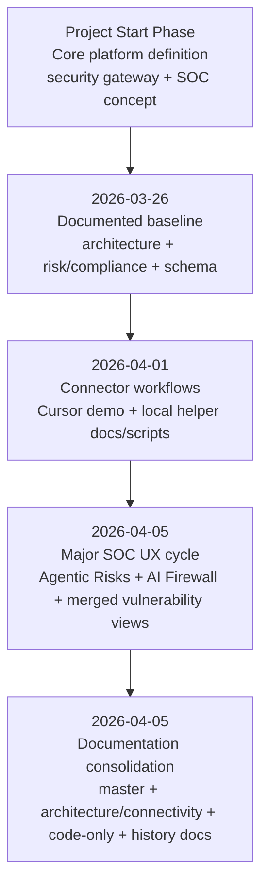
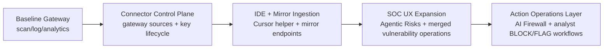
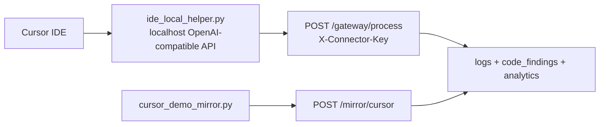

# AI Security Monitoring Tool - End-to-End Work History (From Project Start)

Last updated: 2026-04-05

## 1) Why this document

This is the merged, from-scratch record of work completed for **Build AI Security Monitor** context, including:

- original platform foundation work
- last 1 week of detailed progress
- latest frontend/backend enhancements and rollbacks

This document is intentionally not “today-only”; it covers the build journey from the initial baseline to the current state.

---

## 2) Scope window covered

### Foundation baseline (project start context)

- Initial platform design and security model setup
- Core backend/frontend scaffolding
- Risk/compliance/architecture documentation foundation
- Baseline APIs, auth, and monitoring model

### One-week detailed progress window

- **2026-03-31 to 2026-04-05** (latest enhancement cycle)

Evidence sources used:

- docs timestamps and code timestamps in `frontend`, `backend`, and `scripts`
- implemented endpoint/page behavior in current codebase

Note:

- This workspace currently has no `.git` history available, so the timeline is built from document/code timestamps + implemented feature state.

---

## 3) Build journey at a glance



---

## 4) Full progress timeline (from start)

## Phase 0 - Project start foundation (initial build context)

Completed in initial build phase:

1. Security gateway architecture defined for AI request inspection.
2. Core SOC model established: detect -> classify -> score -> enforce -> log -> investigate.
3. Baseline API set introduced (`/scan`, `/logs`, `/analytics`, auth endpoints).
4. Auth/RBAC direction established (`admin`, `analyst` roles).
5. Audit-chain/compliance-first documentation included.
6. Deploy model drafted (Docker, Prometheus, Grafana).

This baseline context is represented by foundational project docs and core backend/frontend structure.

## 2026-03-26 (documented baseline snapshot)

Artifacts indicating baseline maturity:

1. Architecture reference (`architecture.md`)
2. Risk scoring framework (`risk_scoring_framework.md`)
3. Compliance logging guidance (`compliance_logging.md`)
4. DB schema reference (`database_schema.sql`)
5. Red-team prompt attack set (`red_team_prompt_injection_attacks.md`)

## 2026-03-27 to 2026-03-30 (platform wiring hardening)

Observed platform areas consolidated in this period based on current code state:

1. Backend route/auth/database wiring consolidation
2. Risk modules and policy engine integration
3. Metrics/middleware startup plumbing
4. Base frontend app shell and route orchestration

Core files reflecting this stabilized base:

- `/Users/snarayanan/Documents/AI Security/ai_security_monitoring_tool/backend/app/main.py`
- `/Users/snarayanan/Documents/AI Security/ai_security_monitoring_tool/backend/app/routes/security.py`
- `/Users/snarayanan/Documents/AI Security/ai_security_monitoring_tool/frontend/src/App.jsx`

## 2026-03-31 (integration reliability and ingest prep)

Main outcomes:

1. Frontend API/auth utility stabilized for token-aware calls.
2. Mirror integration artifacts matured (browser/userscript path).
3. Backend startup/auth wiring stabilized for operational boot.

Representative files:

- `/Users/snarayanan/Documents/AI Security/ai_security_monitoring_tool/frontend/src/lib/apiFetch.js`
- `/Users/snarayanan/Documents/AI Security/ai_security_monitoring_tool/backend/app/main.py`
- `/Users/snarayanan/Documents/AI Security/ai_security_monitoring_tool/docs/chatgpt_mirror_tampermonkey.user.js`

## 2026-04-01 (connector and IDE-connectivity enablement)

Main outcomes:

1. Cursor quick demo path formalized.
2. Local IDE helper workflow documented and operationalized.
3. Control-plane roadmap documentation expanded.
4. Integrations page matured to support connector lifecycle operations.

Representative files:

- `/Users/snarayanan/Documents/AI Security/ai_security_monitoring_tool/scripts/cursor_demo_mirror.py`
- `/Users/snarayanan/Documents/AI Security/ai_security_monitoring_tool/docs/cursor-demo.md`
- `/Users/snarayanan/Documents/AI Security/ai_security_monitoring_tool/docs/ide-local-helper.md`
- `/Users/snarayanan/Documents/AI Security/ai_security_monitoring_tool/frontend/src/pages/Integrations.jsx`

## 2026-04-02 to 2026-04-04 (security operations depth expansion)

Cumulative capabilities in this phase:

1. Connector source lifecycle operations matured (create/rotate/disable/enable).
2. Gateway process/evaluate patterns reinforced for external IDE traffic.
3. Logging and analyst workflow patterns matured in preparation for firewall/action queue UX.

Representative backend zones:

- `/Users/snarayanan/Documents/AI Security/ai_security_monitoring_tool/backend/app/routes/security.py`
- `/Users/snarayanan/Documents/AI Security/ai_security_monitoring_tool/backend/app/sqlite_store.py`

## 2026-04-05 (major SOC UX hardening cycle)

Main outcomes:

1. Requests/log filtering and sorting improvements completed.
2. Agentic AI Risks tab added and made interactive/readable.
3. Top AI Risks interactions and cleanup (including `none` removal).
4. Supply Chain and Vulnerability Findings unified into one analyst view.
5. Sidebar/navigation simplified per SOC workflow.
6. AI Firewall tab added and technically tuned for analyst actions.
7. Posture page improved.
8. Documentation and raw-code exports consolidated.

Representative files:

- `/Users/snarayanan/Documents/AI Security/ai_security_monitoring_tool/frontend/src/pages/Requests.jsx`
- `/Users/snarayanan/Documents/AI Security/ai_security_monitoring_tool/frontend/src/pages/AgenticRisks.jsx`
- `/Users/snarayanan/Documents/AI Security/ai_security_monitoring_tool/frontend/src/pages/Dashboard.jsx`
- `/Users/snarayanan/Documents/AI Security/ai_security_monitoring_tool/frontend/src/pages/SupplyChain.jsx`
- `/Users/snarayanan/Documents/AI Security/ai_security_monitoring_tool/frontend/src/pages/Posture.jsx`
- `/Users/snarayanan/Documents/AI Security/ai_security_monitoring_tool/frontend/src/pages/AIFirewall.jsx`
- `/Users/snarayanan/Documents/AI Security/ai_security_monitoring_tool/frontend/src/App.jsx`
- `/Users/snarayanan/Documents/AI Security/ai_security_monitoring_tool/frontend/src/components/SidebarNav.jsx`
- `/Users/snarayanan/Documents/AI Security/ai_security_monitoring_tool/backend/app/routes/security.py`
- `/Users/snarayanan/Documents/AI Security/ai_security_monitoring_tool/backend/app/sqlite_store.py`

---

## 5) Build AI Security Monitor context merged (what was built overall)

## 5.1 Platform foundation (from initial build context)

1. FastAPI security gateway with auth and role-aware flows.
2. Risk detection and policy enforcement engine.
3. Logging, analytics, threat summary, alerts, and audit support.
4. Supply-chain and threat-intel supporting paths.
5. React SOC dashboard surface for analysts.

## 5.2 Security controls implemented

1. Prompt and response risk classification.
2. Risk score + severity derivation.
3. Decisioning (`SAFE`, `WARNING`, `BLOCKED`) and action mapping.
4. Analyst post-processing actions (`BLOCK`, `FLAG`) on log records.

## 5.3 Data and persistence model in active use

Operational SQLite tables:

1. `logs`
2. `connector_sources`
3. `code_findings`
4. `threat_intel_rules`

---

## 6) Major enhancement set completed in current cycle

## A) Requests and log operations

Completed:

1. Risk score-based querying (`min_risk_score`, `max_risk_score`).
2. Sort controls (`timestamp`, `severity`, `risk_score`, asc/desc).
3. Frontend-request filtering updates to match backend capability.

## B) Agentic AI Risks

Completed:

1. New dedicated tab and route.
2. Interactive card/detail behavior for analyst drilldown.
3. Readability fixes for previously non-readable categories.
4. Removed noisy instructional labels and low-signal content.

## C) Top AI Risks hardening

Completed:

1. Removed invalid `none` bucket from action-oriented views.
2. Added/kept actionable interaction flow (click-to-details and investigation UX).

## D) Vulnerability Findings + Supply Chain unification

Completed:

1. Consolidated to single operational view.
2. Preserved supply-chain style columns for vulnerability entries.
3. Kept route compatibility (`/vulnerability-findings` redirects to `/supply-chain`).

## E) Navigation cleanup

Completed:

1. Removed `Risks` item from sidebar.
2. Removed `Visibility` item from sidebar.
3. Renamed sidebar display to `Vulnerability Findings`.

## F) AI Firewall (new action-oriented SOC workspace)

Completed:

1. New tab and route.
2. Policy control-plane visibility.
3. Block/warn/allow telemetry and risky-allow tracking.
4. Analyst action queue and priority scoring.
5. One-click `BLOCK`/`FLAG` integration with backend action endpoint.
6. Source quarantine candidates.
7. Burst/drift risk signal detection.
8. Decision matrix and queue export.

---

## 7) Architecture evolution diagram (baseline to current)



---

## 8) Cursor connectivity work completed (merged context)

Two supported integration paths are in place:

1. **Connector path (recommended)**  
   `Cursor -> local IDE helper -> /gateway/process -> policy/logging -> OpenAI-compatible response`

2. **Mirror demo path**  
   `cursor_demo_mirror.py -> /mirror/cursor -> risk + policy + logging`



---

## 9) Rollbacks and corrective actions performed

To preserve working behavior while evolving features:

1. Dashboard route mapping restored when temporary reroute was not desired.
2. Compatibility redirects retained instead of hard removals.
3. Repeated readability and detail-layout corrections applied for risk tabs.
4. Non-actionable strings/elements removed when explicitly rejected.

---

## 10) Documentation and deliverables produced so far

Primary docs:

1. `/Users/snarayanan/Documents/AI Security/ai_security_monitoring_tool/docs/build_ai_security_monitor_master_document.md`
2. `/Users/snarayanan/Documents/AI Security/ai_security_monitoring_tool/docs/tool_spec_architecture_cursor_connectivity.md`
3. `/Users/snarayanan/Documents/AI Security/ai_security_monitoring_tool/docs/tool_code_only_appendix.md`
4. `/Users/snarayanan/Documents/AI Security/ai_security_monitoring_tool/docs/work_carried_out_detailed.md` (this document)

Raw code exports:

1. `/Users/snarayanan/Documents/AI Security/ai_security_monitoring_tool/exports/ai_security_monitoring_tool_raw_code_dump.txt`
2. `/Users/snarayanan/Documents/AI Security/ai_security_monitoring_tool/exports/ai_security_monitoring_tool_raw_code.tar.gz`

---

## 11) Current status statement

Current platform state after merged work:

1. SOC-friendly navigation and fewer dead/noisy paths
2. Stronger analyst action workflows (especially AI Firewall)
3. Unified vulnerability + supply chain operations view
4. Improved Agentic AI risk explainability and readability
5. Connector-ready architecture for IDE-origin AI security monitoring
6. Consolidated technical documentation for handoff and continuation

---

## 12) Auto-update setup for this same page

Implemented automation scripts:

1. `/Users/snarayanan/Documents/AI Security/ai_security_monitoring_tool/scripts/auto_capture_work_history.py`
2. `/Users/snarayanan/Documents/AI Security/ai_security_monitoring_tool/scripts/start_work_history_daemon.sh`
3. `/Users/snarayanan/Documents/AI Security/ai_security_monitoring_tool/scripts/status_work_history_daemon.sh`
4. `/Users/snarayanan/Documents/AI Security/ai_security_monitoring_tool/scripts/stop_work_history_daemon.sh`

Active behavior:

- Background daemon appends periodic `Auto Update` sections to this document based on changed files.
- Current state tracking file:  
  `/Users/snarayanan/Documents/AI Security/ai_security_monitoring_tool/docs/.work_history_state.json`

Operational commands:

```bash
cd "/Users/snarayanan/Documents/AI Security/ai_security_monitoring_tool"

# start auto-capture every 30 minutes (1800 seconds)
./scripts/start_work_history_daemon.sh 1800

# check daemon status
./scripts/status_work_history_daemon.sh

# stop daemon
./scripts/stop_work_history_daemon.sh

# manual one-time append
python3 ./scripts/auto_capture_work_history.py --note "Manual capture"
```

---

## Auto Update - 2026-04-05 20:51:14 IST

- Capture note: Automation initialized
- Window start (UTC): 2026-04-05 09:21:14 UTC
- Captured at (UTC): 2026-04-05 15:21:14 UTC
- Changed files detected: 25

### Changed file summary by area
- backend: 7 file(s)
  - `backend/.DS_Store`
  - `backend/alembic/.DS_Store`
  - `backend/app/.DS_Store`
  - `backend/app/routes/security.py`
  - `backend/app/schemas.py`
  - `backend/app/services/supply_chain_scanner.py`
  - `backend/app/sqlite_store.py`
- docs: 4 file(s)
  - `docs/build_ai_security_monitor_master_document.md`
  - `docs/tool_code_only_appendix.md`
  - `docs/tool_spec_architecture_cursor_connectivity.md`
  - `docs/work_carried_out_detailed.md`
- frontend: 9 file(s)
  - `frontend/.DS_Store`
  - `frontend/src/App.jsx`
  - `frontend/src/components/SidebarNav.jsx`
  - `frontend/src/pages/AIFirewall.jsx`
  - `frontend/src/pages/AgenticRisks.jsx`
  - `frontend/src/pages/Dashboard.jsx`
  - `frontend/src/pages/Posture.jsx`
  - `frontend/src/pages/Requests.jsx`
  - `frontend/src/pages/SupplyChain.jsx`
- scripts: 5 file(s)
  - `scripts/auto_capture_work_history.py`
  - `scripts/install_work_history_capture_launchd.sh`
  - `scripts/status_work_history_capture_launchd.sh`
  - `scripts/uninstall_work_history_capture_launchd.sh`
  - `scripts/work_history_capture_runner.sh`

---

## Auto Update - 2026-04-05 20:52:51 IST

- Capture note: Scheduled auto capture
- Window start (UTC): 2026-04-05 15:21:14 UTC
- Captured at (UTC): 2026-04-05 15:22:51 UTC
- Changed files detected: 1

### Changed file summary by area
- docs: 1 file(s)
  - `docs/.work_history_state.json`
